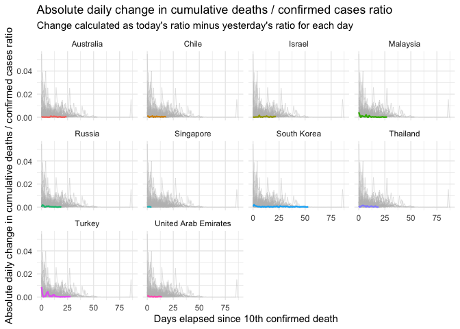

F-sabiti
================
Mine Çetinkaya-Rundel
20 April 2020

COVID-19 data are downloaded from [Our World in Data’s GitHub
Repository](https://raw.githubusercontent.com/owid/covid-19-data/master/public/data/owid-covid-data.csv)
on 20 April 2020.

The data has been filtered for dates after 10th death for each country.
This means that countries with less than 10 total deaths due to COVID-19
so far are not included in the analysis, leaving 92 countries for
analysis of all countries and 46 for analysis of all countries with more
than 100 total deaths due to COVID-19.

This document addresses (though doesn’t exactly answer) two questions:

1.  Is the consistency in Turkey’s cumulative deaths to cumulative
    confirmed cases ratio across consecutive days naturally occurring or
    might it indicate manipulation in numbers?

2.  Can Benford’s law be used to explore whether the numbers reported by
    Turkey are real or manipulated?

In certain points in the document we compare Turkey to all other
countries or to all other countries with more than 100 deaths. In other
points, to keep visualisations simple, we compare Turkey to a select
list of countries consisting of China, Germany, Italy, United States,
and United Kingdom.

## Change in ratio over time

The figure below shows how the ratio of cumulative deaths to cumulative
confirmed cases changes over time. Each line represents one country and
we can see that this ratio behaves very differently for many countries.
Turkey’s trajectory does look pretty stable compared to some of the
other countries highlighted in this plot, but this figure alone does not
provide sufficient evidence to suspect manipulation in numbers.

<!-- -->

The figure below is another look at this same ratio, but only for
countries that have had more than 100 deaths. Even though the number of
countries plotted is halved, the trajectories look very similar what we
saw in the figure above; limiting the analysis to countries with larger
number of deaths does not provide any new insights.

<!-- -->

### Daily change in ratio

Since suspicion of manipulation of numbers was due to little to no
change in the cumulative deaths to confirmed cases ratio over a number
of days in Turkey, it is worthwhile to explore the daily change in this
ratio in other countries as well, and see how Turkey compares.

We can see that the daily change in the ratio approaches 0 for most
countries as days elapsed increases.

<!-- -->

Since we’re interested in whether the ratio changes from day to day and
how much, but not in which direction, it’s actually more useful to look
at the absolute value of daily change.

<!-- -->

### Number of consecutive days with no change

The following figure shows the number of consecutive days with no
change, split by whether the country has had more than 100 total deaths
or not. “No change” is calculated to the third decimal, e.g. suppose
today country’s cumulative death to confirmed cases ratio is 0.021
(rounded to 3 digits) and yesterday is was 0.021 (rounded to 3 digits)
as well.

<!-- -->

The following graphs shows the same, except here the ratios are rounded
to 4 decimals (e.g. 0.0211).

<!-- -->

The stark difference between these two graphs show that how the values
are rounded can change the story. It’s possible the numbers are
manipulated, but the measure of number of consecutive days of
manipulation depends on rounding.

### Average absolute daily change in ratio

The following table lists the countries with the 9 lowest average
absolute daily change in cumulative deaths / confirmed cases ratio.

<!--html_preserve-->

<table class="gt_table" style="table-layout: fixed; width: 400px">

<colgroup>

<col style="width: 100px"/>

<col style="width: 100px"/>

<col style="width: 200px"/>

</colgroup>

<thead class="gt_col_headings">

<tr>

<th class="gt_col_heading gt_columns_bottom_border gt_left" rowspan="1" colspan="1">

Country

</th>

<th class="gt_col_heading gt_columns_bottom_border gt_center" rowspan="1" colspan="1">

Number of days of data

</th>

<th class="gt_col_heading gt_columns_bottom_border gt_right" rowspan="1" colspan="1">

Average absolute daily change in cumulative deaths / confirmed cases
ratio

</th>

</tr>

</thead>

<tbody class="gt_table_body">

<tr>

<td class="gt_row gt_left">

Singapore

</td>

<td class="gt_row gt_center">

5

</td>

<td class="gt_row gt_right">

0.00025

</td>

</tr>

<tr>

<td class="gt_row gt_left">

Australia

</td>

<td class="gt_row gt_center">

25

</td>

<td class="gt_row gt_right">

0.00034

</td>

</tr>

<tr>

<td class="gt_row gt_left">

United Arab Emirates

</td>

<td class="gt_row gt_center">

15

</td>

<td class="gt_row gt_right">

0.00040

</td>

</tr>

<tr>

<td class="gt_row gt_left">

South Korea

</td>

<td class="gt_row gt_center">

54

</td>

<td class="gt_row gt_right">

0.00043

</td>

</tr>

<tr>

<td class="gt_row gt_left">

Russia

</td>

<td class="gt_row gt_center">

20

</td>

<td class="gt_row gt_right">

0.00045

</td>

</tr>

<tr>

<td class="gt_row gt_left">

Israel

</td>

<td class="gt_row gt_center">

23

</td>

<td class="gt_row gt_right">

0.00046

</td>

</tr>

<tr>

<td class="gt_row gt_left">

Chile

</td>

<td class="gt_row gt_center">

19

</td>

<td class="gt_row gt_right">

0.00056

</td>

</tr>

<tr>

<td class="gt_row gt_left">

Malaysia

</td>

<td class="gt_row gt_center">

28

</td>

<td class="gt_row gt_right">

0.00061

</td>

</tr>

<tr>

<td class="gt_row gt_left">

Thailand

</td>

<td class="gt_row gt_center">

20

</td>

<td class="gt_row gt_right">

0.00065

</td>

</tr>

</tbody>

</table>

<!--/html_preserve-->

The following graph compares the trajectories of absolute daily change
in ratio of these 9 countries to Turkey’s.

<!-- -->

In addition to looking at daily change, let’s also see how Turkey
compares to these countries with regards to the trajectory of the ratio.

<!-- -->

<!-- -->

Let’s repeat this analysis for countries with more than 100 total
deaths.

<!--html_preserve-->

<table class="gt_table" style="table-layout: fixed; width: 300px">

<colgroup>

<col style="width: 100px"/>

<col style="width: 200px"/>

</colgroup>

<thead class="gt_col_headings">

<tr>

<th class="gt_col_heading gt_columns_bottom_border gt_left" rowspan="1" colspan="1">

Country

</th>

<th class="gt_col_heading gt_columns_bottom_border gt_right" rowspan="1" colspan="1">

Average absolute daily change in cumulative deaths / confirmed cases
ratio

</th>

</tr>

</thead>

<tbody class="gt_table_body">

<tr>

<td class="gt_row gt_left">

South Korea

</td>

<td class="gt_row gt_right">

0.00043

</td>

</tr>

<tr>

<td class="gt_row gt_left">

Russia

</td>

<td class="gt_row gt_right">

0.00045

</td>

</tr>

<tr>

<td class="gt_row gt_left">

Israel

</td>

<td class="gt_row gt_right">

0.00046

</td>

</tr>

<tr>

<td class="gt_row gt_left">

Chile

</td>

<td class="gt_row gt_right">

0.00056

</td>

</tr>

<tr>

<td class="gt_row gt_left">

Norway

</td>

<td class="gt_row gt_right">

0.00069

</td>

</tr>

<tr>

<td class="gt_row gt_left">

Pakistan

</td>

<td class="gt_row gt_right">

0.00076

</td>

</tr>

<tr>

<td class="gt_row gt_left">

Germany

</td>

<td class="gt_row gt_right">

0.00090

</td>

</tr>

<tr>

<td class="gt_row gt_left">

China

</td>

<td class="gt_row gt_right">

0.00091

</td>

</tr>

<tr>

<td class="gt_row gt_left">

Austria

</td>

<td class="gt_row gt_right">

0.00103

</td>

</tr>

</tbody>

</table>

<!--/html_preserve-->

<!-- -->

<!-- -->

Turkey is in neither of these lists, indicating that whether we look at
all countries or countries with more than 100 deaths, the variability in
Turkey’s daily ratios of confirmed deaths to confirmed cases isn’t as
low as some of the other countries.

### Daily deaths / confirmed cases

Ultimately, I think focusing on the ratio of cumulative deaths to
confirmed cases is difficult to reason around. Comparing trajectories of
daily deaths to daily confirmed cases, instead of cumulative versions of
these numbers, can also be useful.

<!-- -->

We can zoom in to this plot, limiting the y-axis to 0 to 0.1. Turkey’s
trajectory doesn’t look too different than the initial trajectory of the
US.

<!-- -->

## Benford’s law

Imagine a large dataset, say something like a list of every country and
its population. Benford’s Law states that the leading digit will be a 1
more often than a 2. And 2s would probably occur more often than 3s, and
so on. If a set of values were truly random, each leading digit would
appear about 11% of the time (1/9), but Benford’s Law predicts a
logarithmic distribution. Since this phenomenon applies to naturally
occurring numbers, it’s used in fraudulent accounting/reporting
detection.

### Distribution of digits

The figure below shows the distribution of first and second digits in
new and total confirmed cases and in new and total deaths in numbers
reported by Turkey.

<!-- -->

Literature also suggests that focusing on not just the first or second
digit, but instead the combination of them (the string of two digits) is
a more robust measure. The figure below shows the distribution of first
two digits (together) in new and total confirmed cases and in new and
total deaths in numbers reported by Turkey.

<!-- -->

We can compare Turkey’s numbers to a few other countries.

<!-- -->

### Chi-square testing for Benford’s law

When data should conform to Benford’s law, a null-hypothesis rejection
suggests that some form of data manipulation has taken place
([Joenssen, 2013](https://www.statistics.gov.hk/wsc/CPS021-P2-S.pdf)).
Rejection requires a low p-value, generally lower than 0.05. We will
apply this test for numbers of new cases and new deaths for the 46
countries with more than 100 deaths. Since we’re running many tests at
once, we would apply a [Bonferroni
correction](https://en.wikipedia.org/wiki/Bonferroni_correction), which
reduces the threshold to 0.0005.

<!-- -->

The test yields a positice result for values of new deaths in Turkey,
but not new cases. This doesn’t necessarily mean that the number are
manipulated, but there is evidence to suggest that they don’t follow
Benford’s law.
